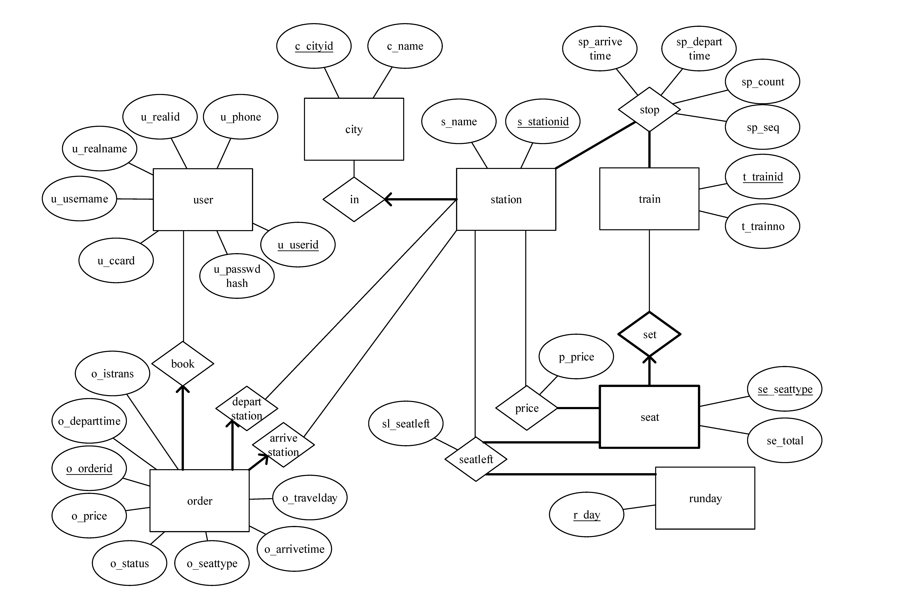
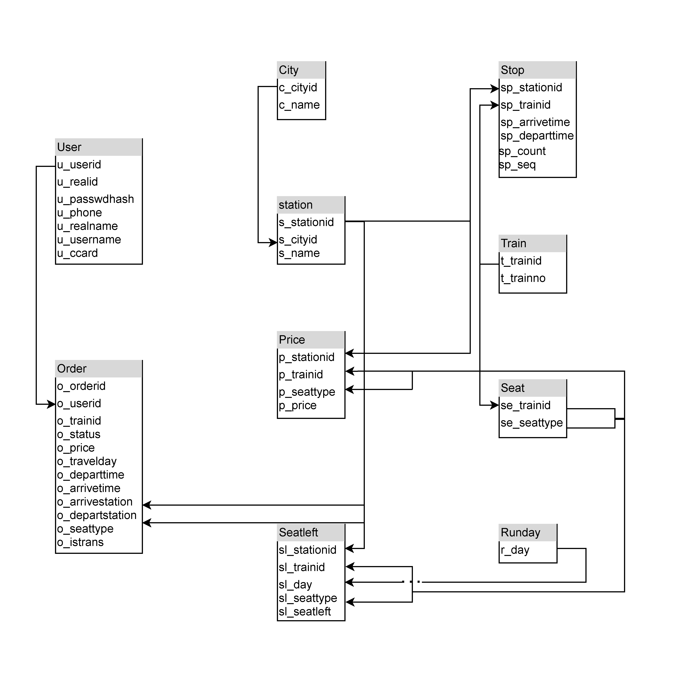

# 火车订票系统 设计报告

何南 2018K8009918003

郭光曜 2018K8009929007

陈彦帆 2018K8009918002

[TOC]

## 1. 数据库系统设计

### ER图

我们设计的实体-联系图中共有6个实体集。4个强实体分别为user：描述用户属性，station：描述车站属性，train：描述列车属性，order：描述订单属性。

seat是一个弱实体，依赖于train而存在，和train一起描述某个列车上各种类型的座位总数。其中se_seattype是部分键，用于决定每个列车中的座位类型。

runday是一个弱实体，依赖于train而存在，和train一起描述某个列车的所有发车日期。其中r_day是部分键，用于确定每个列车的发车日期。

stop是train和station之间多对多的联系，描述每个列车在每个车站的到达、出发时刻。

price是seat和station之间多对多的联系，描述每个列车每种座位类型在某个站的累积价格。注意到有的站不售票，有的station没有参与这个联系。

seatleft是seat,station和runday的三元联系，描述每个列车在每个发车日期在某个站的座位剩余情况。注意到有的站不售票，故有的station没有参与这个联系。

### 关系模式

#### schema

#### table layouts

1. city 城市

| 列名     | 描述     | 数据种类    | 附注          |
| -------- | -------- | ----------- | ------------- |
| c_cityid | 城市序号 | int         | candidate key |
| c_name   | 城市名   | varchar(20) | candidate key |

Primary Key：c_cityid

​	

2. station 车站

| 列名        | 描述               | 数据种类    | 附注                                             |
| ----------- | ------------------ | ----------- | ------------------------------------------------ |
| s_stationid | 车站序号           | int         | candidate key                                    |
| s_cityid    | 车站所在的城市序号 | int         | foreign key (s_cityid) references city(c_cityid) |
| s_name      | 车站名             | varchar(20) | candidate key                                    |

Primary Key：s_stationid

3. train 火车

| 列名      | 描述       | 数据种类 | 附注          |
| --------- | ---------- | -------- | ------------- |
| t_trainid | 火车序号   | int      | candidate key |
| t_trainno | 火车车次号 | char(6)  | candidate key |

Primary Key：t_trainid

4. seat 座位表

| 列名        | 描述                       | 数据种类 | 附注                                                 |
| ----------- | -------------------------- | -------- | ---------------------------------------------------- |
| se_trainid  | 火车序号                   | int      | foreign key (se_trainid) references train(t_trainid) |
| se_seattype | 座位类型                   | enum     | 可能包括硬座/软座，硬卧（上/中/下），软卧（上/下）   |
| se_total    | 该火车该座位类型的座位总数 | int      |                                                      |

Compound Primary Key：se_trainid，se_seattype

5. stop 火车时刻表

| 列名          | 描述     | 数据种类 | 附注                                                       |
| ------------- | -------- | -------- | ---------------------------------------------------------- |
| sp_stationid  | 车站序号 | int      | foreign key (sp_stationid) references station(s_stationid) |
| sp_trainid    | 火车序号 | int      | foreign key (sp_trainid) references train(t_trainid)       |
| sp_arrivetime | 到达时间 | time     | time的day域记录火车跨过午夜的次数                          |
| sp_departtime | 离开时间 | time     | time的day域记录火车跨过午夜的次数                          |

Compound Primary Key：sp_stationid，sp_trainid  

6. price 座位价格表

| 列名        | 描述     | 数据种类 | 附注                                                         |
| ----------- | -------- | -------- | ------------------------------------------------------------ |
| p_stationid | 车站序号 | int      | foreign key (p_stationid) references station(s_stationid)    |
| p_trainid   | 火车序号 | int      | compound foreign key reference to (se_seattype, se_trainid) with p_seattype |
| p_seattype  | 座位类型 | enum     | compound foreign key reference to (se_seattype, se_trainid) with p_trainid |
| p_price     | 价格     | decimal  |                                                              |

Compound Primary Key：p_stationid，p_trainid，p_seattype

7. runday 发车日期

| 列名      | 描述     | 数据种类 | 附注                                                |
| --------- | -------- | -------- | --------------------------------------------------- |
| r_day     | 发车日期 | date     |                                                     |
| r_trainid | 火车序号 | int      | foreign key (r_trainid) references train(t_trainid) |

Compound Primary Key：r_day，r_trainid

8. seatleft 剩余座位表

| 列名         | 描述     | 数据种类 | 附注                                                         |
| ------------ | -------- | -------- | ------------------------------------------------------------ |
| sl_stationid | 车站序号 | int      | foreign key (sl_stationid) references station(s_stationid)   |
| sl_trainid   | 火车序号 | int      | compound foreign key reference to (r_day, r_trainid) with sl_day compound foreign key reference to (se_seattype, se_trainid) with sl_seattype |
| sl_day       | 发车日期 | date     | compound foreign key reference to (r_day, r_trainid) with sl_day |
| sl_seattype  | 座位类型 | enum     | compound foreign key reference to (se_seattype, se_trainid) with sl_trainid |
| sl_seatleft  | 剩余座位 | int      | initialize as seat(se_total)                                 |

Compound Primary Key：sl_stationid，sl_trainid，sl_day，sl_seattype

9. user 用户

| 列名         | 描述         | 数据类型    | 附注           |
| ------------ | ------------ | ----------- | -------------- |
| u_userid     | 用户序号     | int         | candidate key  |
| u_realid     | 身份证号     | char(18)    | candidate key  |
| u_username   | 用户名       | varchar(20) |                |
| u_realname   | 用户真名     | varchar(20) |                |
| u_ccard      | 信用卡号     | char(16)    |                |
| u_passwdhash | 密码的哈希值 | char(32)    | 不存储明文密码 |
| u_phone      | 电话号码     | bigint      | candidate key  |

Primary Key：u_userid

10. order 订单

| 列名            | 描述       | 数据类型 | 附注                                                         |
| --------------- | ---------- | -------- | ------------------------------------------------------------ |
| o_orderid       | 订单序号   | int      | candidate key                                                |
| o_userid        | 用户序号   | int      | foreign key (o_userid) references user(u_userid)             |
| o_trainid       | 火车序号   | int      | compound foreign key reference to (r_day, r_trainid) with o_travelday |
| o_status        | 订单状态   | enum     | 包括已完成，未完成，已取消                                   |
| o_price         | 订单价格   | decimal  |                                                              |
| o_departtime    | 出发时间   | time     |                                                              |
| o_arrivetime    | 到达时间   | time     |                                                              |
| o_travelday     | 出发日期   | date     | compound foreign key reference to (r_day, r_trainid) with o_trainid |
| o_departstation | 始发站序号 | int      | foreign key (o_departstation) references station(s_stationid) |
| o_arrivestation | 到达站序号 | int      | foreign key (o_arrivestation) references station(s_stationid) |
| o_seattype      | 座位类型   | enum     |                                                              |

Primary Key：o_orderid

### 范式分析

一个关系模式是BCNF的，等价于其所有非平凡完全函数依赖的被依赖方均为候选键。其中，完全函数依赖是指依赖方不依赖于被依赖方的任何一个真子集的函数依赖。接下来我们将说明，上节给出的所有关系模式都是BCNF的。

1. city 城市

假设没有重名的城市，所有的非平凡完全函数依赖有:

c_cityid->其它

c_cname->其它

c_cityid和c_cname都是候选键，故为BCNF。

2. station 车站

假设没有重名的车站，所有的非平凡完全函数依赖有:

s_stationid->其它

s_name->其它

被依赖方均为候选键，故为BCNF

3. train火车

考察所有的非平凡完全函数依赖:

t_trainid->其它

t_trainno->其它

被依赖方均为候选键，故为BCNF

4. seat座位表

考察所有的非平凡完全函数依赖:

se_trainid, se_seattype->se_total

被依赖方为主键，故为BCNF

5. stop火车时刻表

考察所有的非平凡完全函数依赖:

sp_stationid, sp_trainid->sp_arrivetime, sp_departtime

被依赖方为主键，故为BCNF

6. price座位价格表

考察所有的非平凡完全函数依赖:

p_stationid，p_trainid，p_seattype->p_price

被依赖方为主键，故为BCNF

7. runday发车日期

该表所有列均为主键的一部分，故为BCNF

8. seatleft剩余座位

考察所有的非平凡完全函数依赖:

sl_stationid，sl_trainid，sl_day，sl_seattype->sl_seatleft

被依赖方为主键，故为BCNF

9. user 用户

u_userid, u_realid, u_phone均为唯一的，可决定其它所有项，它们都是候选键。除此之外，不存在其它的非平凡完全函数依赖，故为BCNF。

10. order 订单

主键是o_orderid，可决定其它所有属性。

若火车时刻表是不变的，则有以下的非键传递依赖：

o_trainid, o_departstation->o_departtime

o_trainid, o_arrivestation->o_arrivetime

作为修改，只需将o_departtime和o_arrivetime删除即可，需要的时候在stop联系中查询。但考虑到火车时刻表可能变化的情况，给定列车号，出发地和到达地就无法确定出发和到达时刻了。以上的依赖也将不存在。

同样，若火车价格是不变的，有以下的非键传递依赖：

o_trainid, o_departstation, o_arrivestation, o_seattype->o_price

作为修改，只需将o_price删除，需要的时候再通过price联系重新计算订单价格。考虑到火车价格在较长的时间里可能发生变化，又或是打折的情况，以上的依赖就不存在了。故order也是BCNF的。

综上，上节给出的所有关系模式都是BCNF的。